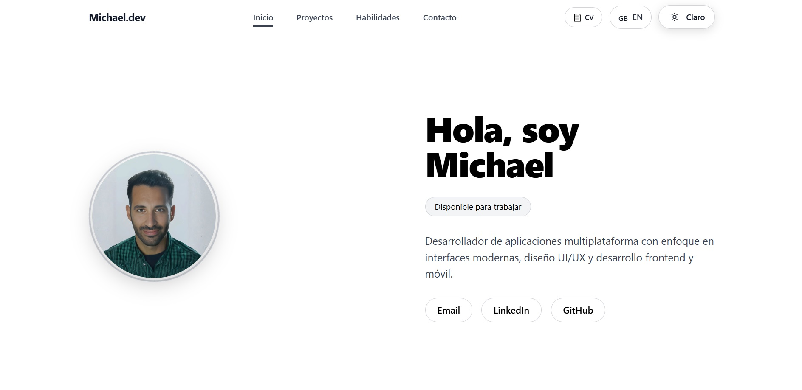
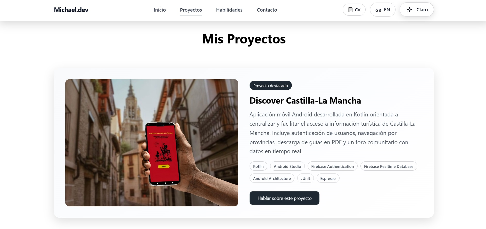
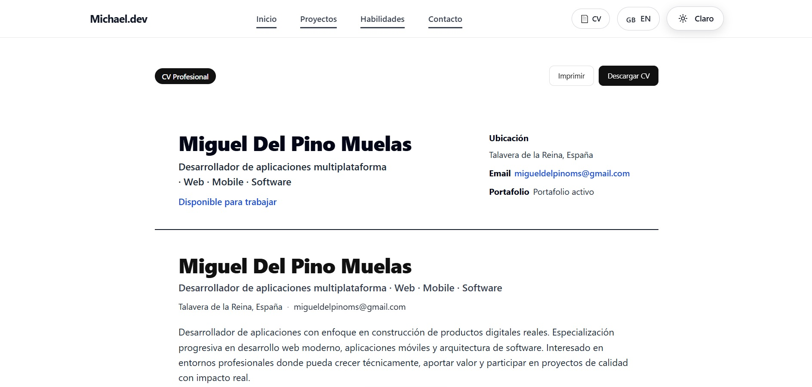
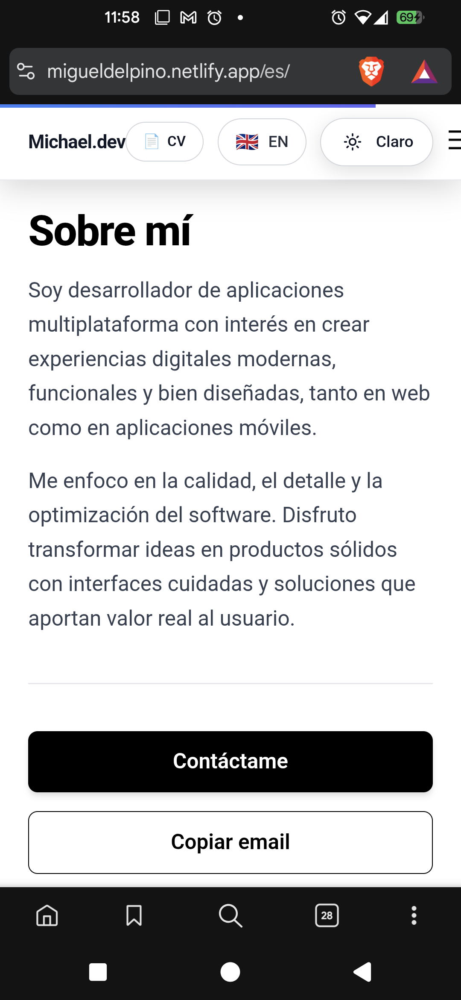

# Developer Portfolio – Miguel Del Pino

Portfolio personal de desarrollador donde muestro mis proyectos, habilidades y experiencia como **Desarrollador de Aplicaciones Multiplataforma (DAM)**.

El objetivo de este portfolio es presentar mis proyectos y tecnologías en un entorno moderno, rápido y accesible.

---

## Portfolio Online

Puedes verlo aquí:

👉 https://migueldelpino.netlify.app

---

## Preview del Portfolio

### Home


### Projects


### CV


### Mobile view


---

## Tecnologías utilizadas

- **Astro**
- **TailwindCSS**
- **JavaScript**
- **HTML5 / CSS3**
- **Netlify (deploy)**

---

## Características

- Diseño responsive
- Dark / Light mode
- Portfolio de proyectos
- CV descargable en PDF
- Contacto directo
- Integración con GitHub y LinkedIn

---

## Stack técnico

### Mobile
- Kotlin
- Android Studio
- Arquitectura MVVM

### Backend
- Java
- Python
- SQL / MySQL

### Web
- HTML
- CSS
- JavaScript
- Astro
- Tailwind

### Herramientas
- Git / GitHub
- Postman
- JUnit
- APIs REST

---

## Contacto

- **LinkedIn**  
  [linkedin.com/in/miguel-del-pino-ms](https://linkedin.com/in/miguel-del-pino-ms)

- **Portfolio**  
  [migueldelpino.netlify.app](https://migueldelpino.netlify.app)

- **Email**  
  [migueldelpinoms@gmail.com](mailto:migueldelpinoms@gmail.com)

---

## Instalación local

Si quieres ejecutar el proyecto en local:

```bash
npm install
npm run dev
